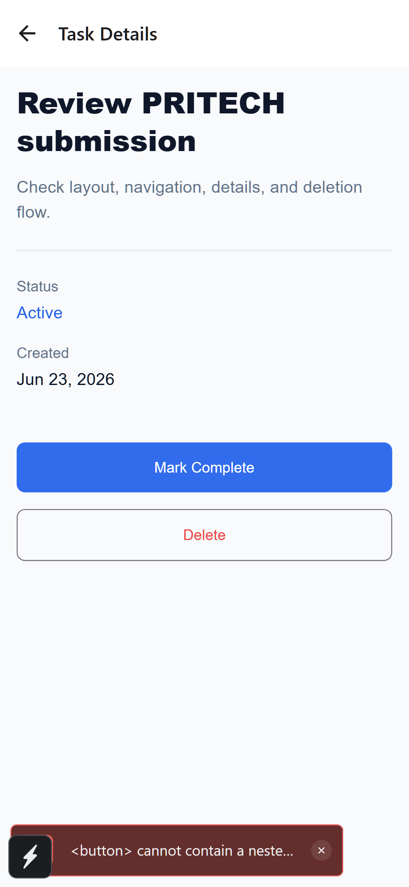
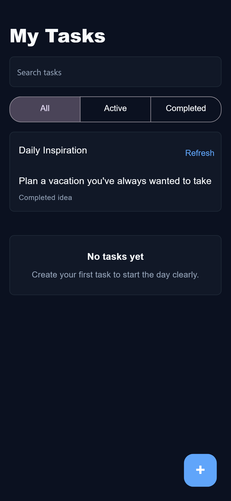

# TaskFlow

TaskFlow is a modern personal task manager built with Expo SDK 56, TypeScript strict mode, AsyncStorage, and Expo Router. Create tasks, track progress, complete work, delete items safely, and get a daily prompt from DummyJSON.

## What was implemented

A full-featured personal task manager built with Expo SDK 56, TypeScript (strict), and Expo Router.

**Core features (all requirements met):**
- Task list with real-time search (300ms debounce) and filter by status (All / Active / Done)
- Add task with title, description, priority, category, and optional due date
- Mark tasks complete / incomplete via swipe action, tap, or detail screen button
- Delete tasks via swipe action or detail screen — with 3.5s undo via snackbar
- Task detail view with full metadata (status, due date, category, created date)
- Input validation: required title, max lengths (100/500 chars), whitespace protection
- Edit existing tasks with pre-populated form
- AsyncStorage persistence — tasks survive app restarts
- DummyJSON /todos API integration — one local daily quote with a live countdown
- Navigation: task list → add → detail → edit (Expo Router Stack)

**Beyond the spec:**
- Priority system (high / medium / low) with colour-coded badges and pulse animation
- Category system (Work / Personal / Health / Study / Other) with emoji labels
- Due date picker (native DateTimePicker on iOS/Android, HTML5 input on web)
- Sort tasks by: date created, priority, due date, alphabetical
- Staggered list entry animations and swipe gesture actions
- Haptic feedback: success/warning/error mapped to semantic actions
- Automatic dark/light mode with a dual-token colour system
- Animated aurora background (three drifting blobs, visible on native via LinearGradient)
- Skeleton loading state for the task list
- Overdue task detection with visual warning bar
- SVG arc ring for completion stats (react-native-svg + Reanimated useAnimatedProps)
- SVG illustrations in empty states (clipboard, magnifier, check circle)

**Tradeoffs:**
- Priority, category, and due date are extra — the spec only requires title/description/status/created date. They were added because they felt natural for a task manager.
- Daily inspiration is tied to the viewer's local calendar day and changes at their next midnight.
- UI tests are omitted to keep scope realistic; unit tests cover all task operations.

## Features

- Task list with add, details, complete, and delete flows
- Real-time search with a 300ms debounce
- All, Active, and Completed filters
- Local persistence with AsyncStorage
- DummyJSON daily quote with a TimeAPI-backed "Next quote in" countdown to local midnight
- Swipe actions for complete and delete
- Automatic dark mode
- Haptic feedback for important actions
- Pull-to-refresh
- Accessible labels and 44×44 minimum touch targets on interactive controls

## Screenshots

| Task List | Task Detail | Dark Mode |
|:---:|:---:|:---:|
|  |  |  |

## Submission Deliverables

- Git repository: https://github.com/rinorabazixx/taskflow-task-manager-app
- Setup instructions: see Installation, Running, and Testing below.
- Short explanation: see What was implemented above.
- Screenshots: see the screenshots table above and the `artifacts/` folder.

## Tech Stack

- Expo SDK 56
- TypeScript in strict mode
- Expo Router
- AsyncStorage
- React Native Paper (MD3)
- React Native Reanimated 4.x
- React Native Gesture Handler
- React Native SVG
- Expo Linear Gradient
- UUID
- Jest

## Architecture

The app uses Expo Router for file-based navigation and a single `TaskContext` in `src/hooks/useTasks.ts` for task state. AsyncStorage is isolated in `src/services/storage.ts`, and the DummyJSON call lives in `src/services/api.ts`.

```text
src/
  components/
  screens/
  hooks/
  services/
  types/
  constants/
  utils/
```

## Installation

```bash
npm install
```

## Running

```bash
npx expo start
```

## Testing

```bash
npm test
npm run typecheck
```

## Design Decisions

- A single context is enough for the four task operations (add, delete, toggle, load).
- AsyncStorage failures fall back gracefully and never crash the UI.
- DummyJSON Todos is directly related to task management, so the public API feature feels natural and isn't forced.
- `StatsRing` uses `react-native-svg` with Reanimated's `useAnimatedProps` to drive `strokeDashoffset` on the native thread, producing a smooth 900 ms arc animation.
- Aurora background blobs use CSS `filter: blur()` on web and `expo-linear-gradient` on native, making the ambient glow visible on both platforms instead of being invisible at 5% opacity.
- Typography uses Poppins only for h1/h2 display sizes (≥24px). h3 through caption all use Inter, producing a cohesive UI voice without font-family noise at small sizes.

## Tradeoffs

- Daily inspiration does not manually refresh; it follows the viewer's local date and rolls over at local midnight.
- Tests focus on business rules and task operations; UI rendering tests are omitted to keep scope realistic.

